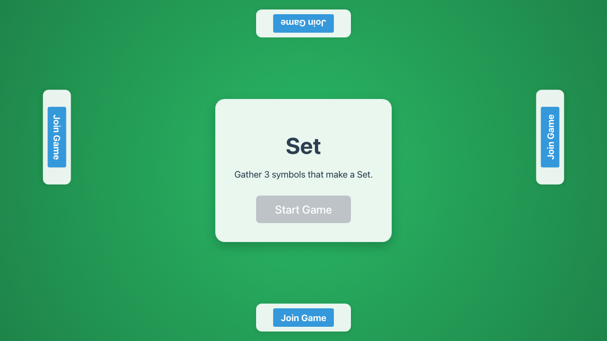
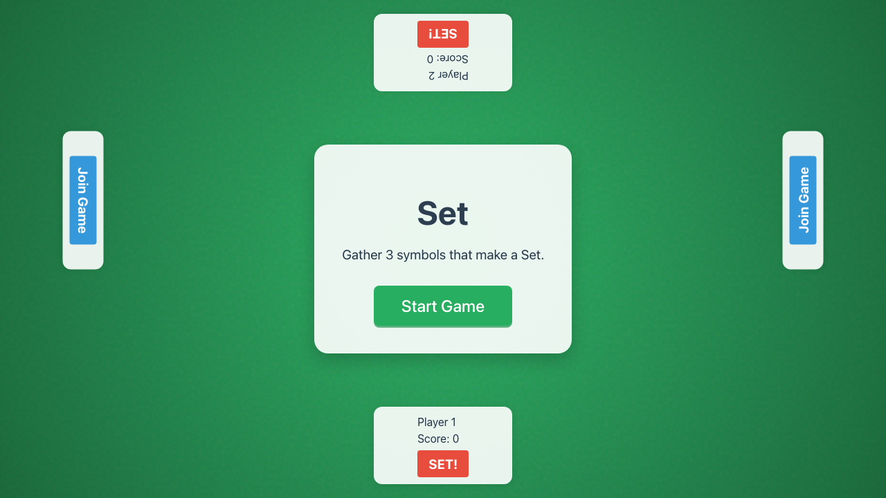
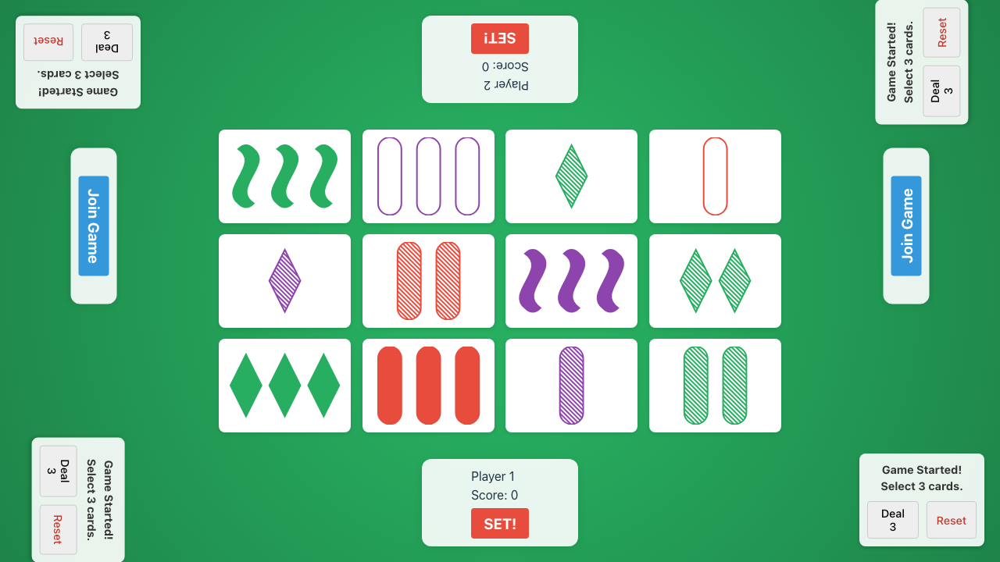
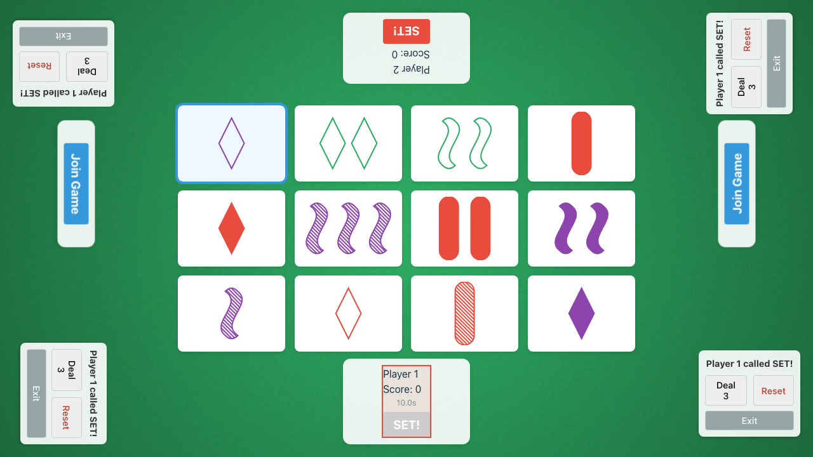

# Game Flow Verification

Verifies that players can join, start the game, and selection logic works.

## Verification Steps

### 1. Initial Lobby

**Screenshot**: `000-lobby.png`

**Verifications**:
- [x] Lobby is visible

---

### 2. Players Joined

**Screenshot**: `001-joined.png`

**Verifications**:
- [x] Player 1 joined at bottom
- [x] Player 2 joined at top

---

### 3. Game Started

**Screenshot**: `002-started.png`

**Verifications**:
- [x] Board is visible with 12 cards
- [x] Start Game button hidden

---

### 4. Selection Active

**Screenshot**: `003-selecting.png`

**Verifications**:
- [x] Player 1 is active
- [x] First card is selected

---

