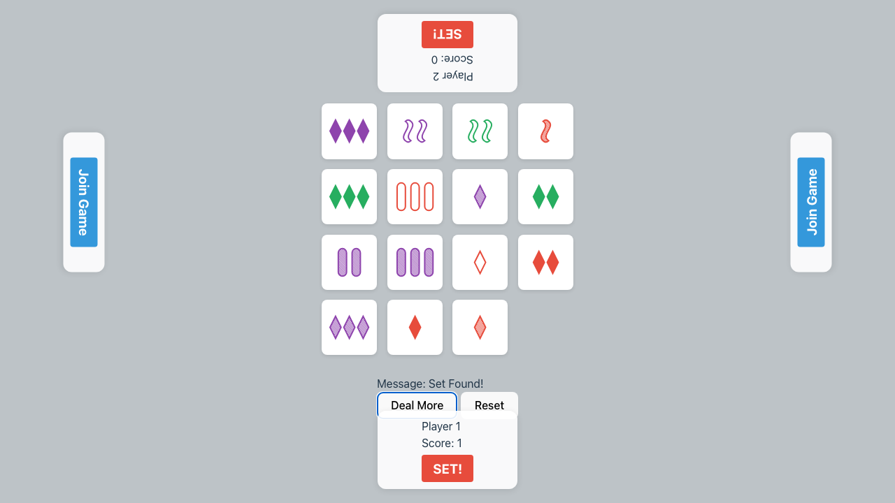
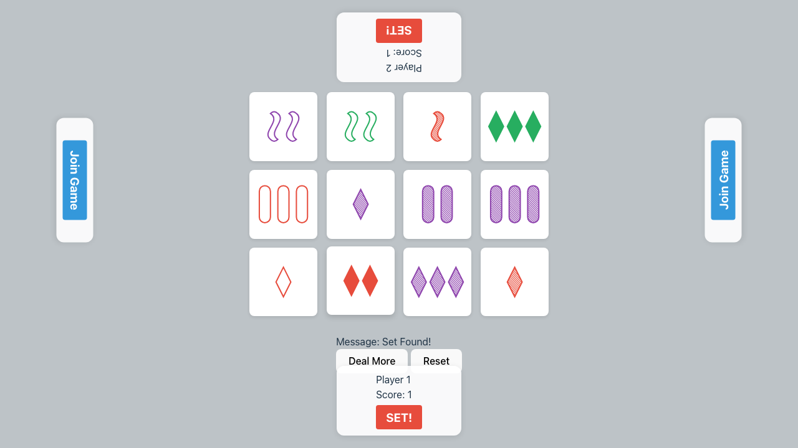
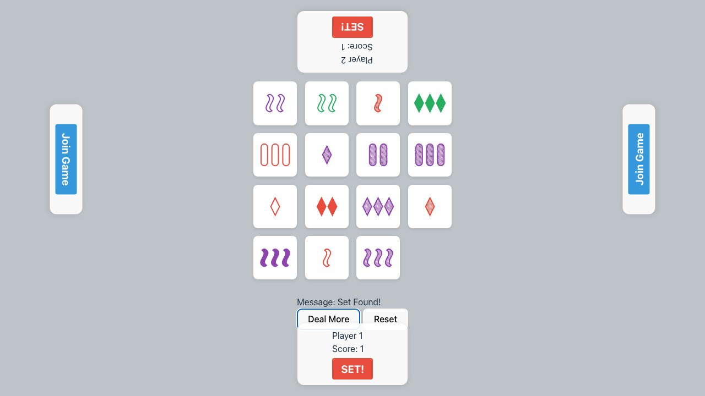

# Seeded Playthrough Verification

Verifies a complete game playthrough with two players using a deterministic seed. Validates game logic, turn taking, and win conditions.

## Verification Steps

### 1. Initial Load

**Screenshot**: `000-initial-load.png`

**Verifications**:
- [x] Lobby is visible

---

### 2. Player 1 Joined

**Screenshot**: `001-player-1-joined.png`

**Verifications**:
- [x] Player 1 HUD shows name

---

### 3. Player 2 Joined

**Screenshot**: `002-player-2-joined.png`

**Verifications**:
- [x] Player 2 HUD shows name

---

### 4. Game Started

**Screenshot**: `003-game-started.png`

**Verifications**:
- [x] Board is visible
- [x] 12 cards are dealt

---

### 5. Turn 1 Complete

**Screenshot**: `004-turn-1-complete.png`

**Verifications**:
- [x] Player 1 found a set: 1-diamond-green-striped, 1-squiggle-green-solid, 1-pill-green-open
- [x] Cards were removed/replaced

---

### 6. Turn 1 Dealt More

**Screenshot**: `005-turn-1-dealt-more.png`

**Verifications**:
- [x] Board size increased

---

### 7. Turn 2 Complete

**Screenshot**: `006-turn-2-complete.png`

**Verifications**:
- [x] Player 2 found a set: 3-diamond-purple-solid, 2-diamond-green-solid, 1-diamond-red-solid
- [x] Cards were removed/replaced

---

### 8. Game Over

**Screenshot**: `007-game-over.png`

**Verifications**:
- [x] Final Scores: P1=1, P2=1

---

