# Seeded Playthrough Verification

Verifies a complete game playthrough with two players using a deterministic seed. Validates game logic, turn taking, and win conditions.

## Verification Steps

### 1. Initial Load

**Screenshot**: `000-initial-load.png`

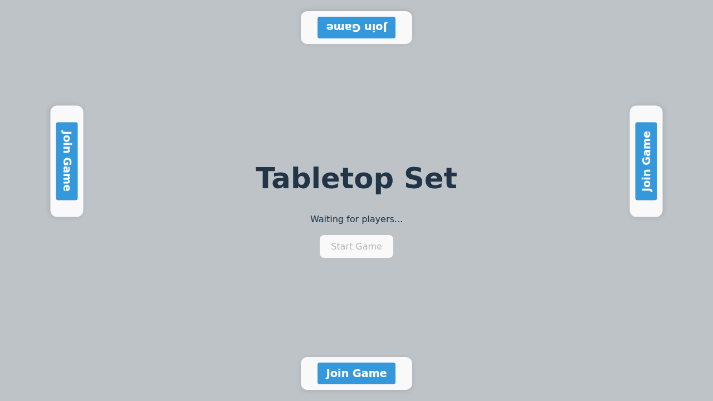

**Verifications**:
- [x] Lobby is visible

---

### 2. Player 1 Joined

**Screenshot**: `001-player-1-joined.png`

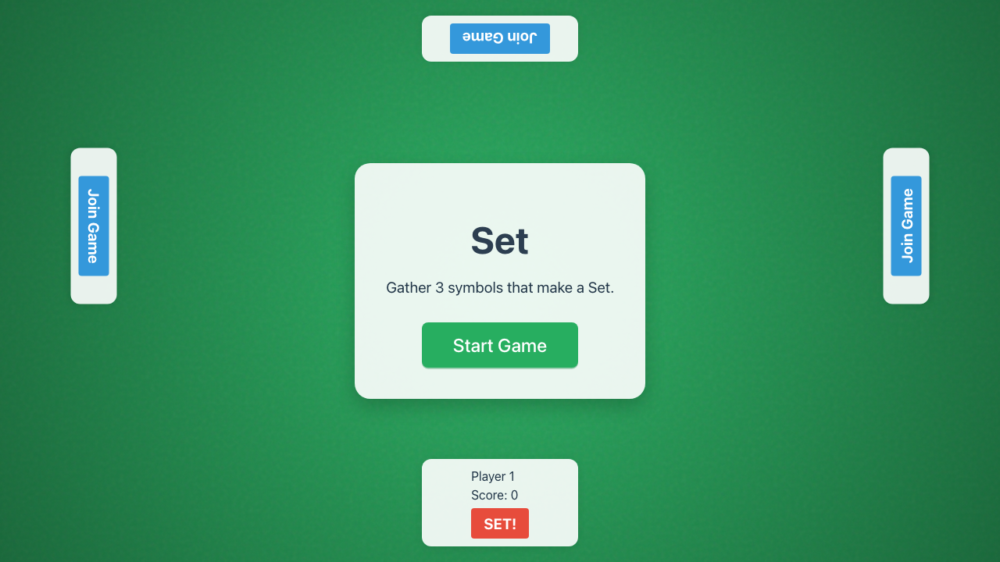

**Verifications**:
- [x] Player 1 HUD shows name

---

### 3. Player 2 Joined

**Screenshot**: `002-player-2-joined.png`

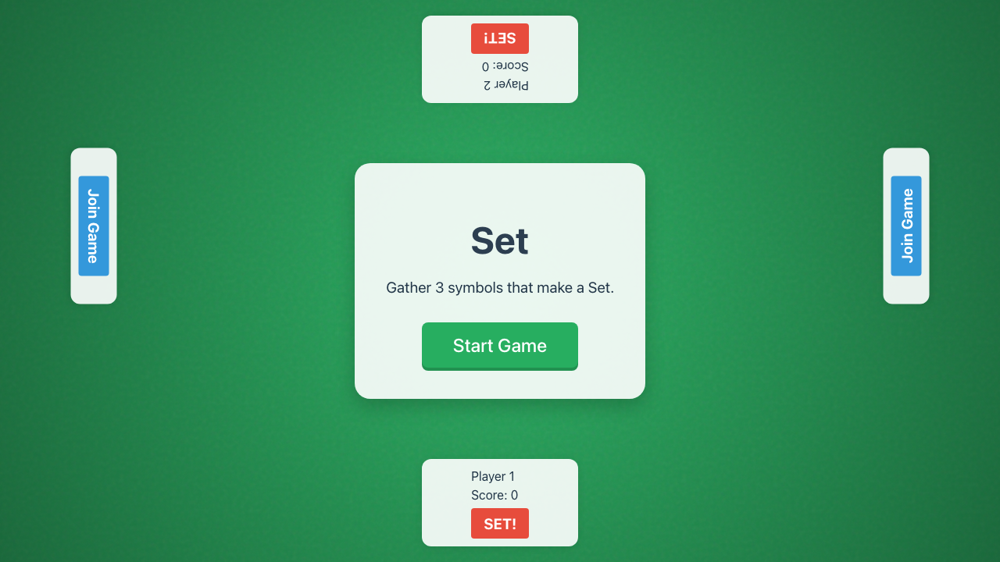

**Verifications**:
- [x] Player 2 HUD shows name

---

### 4. Game Started

**Screenshot**: `003-game-started.png`

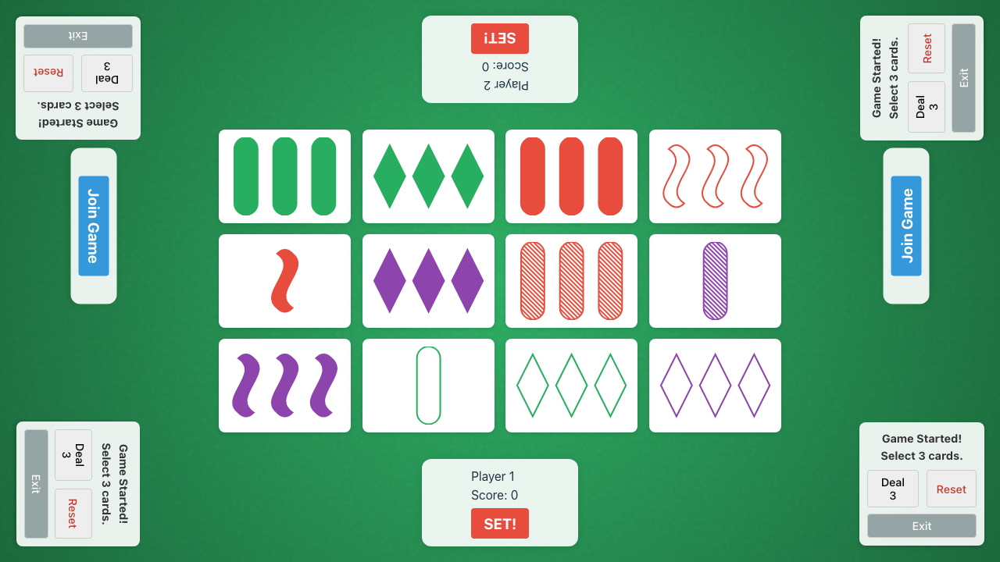

**Verifications**:
- [x] Board is visible
- [x] 12 cards are dealt

---

### 5. Turn 1 Complete

**Screenshot**: `004-turn-1-complete.png`

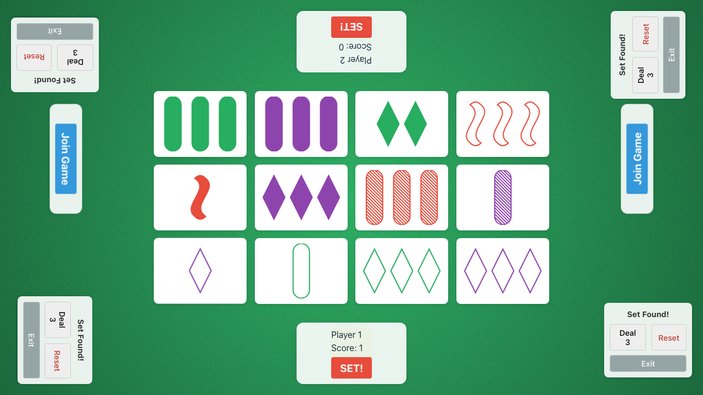

**Verifications**:
- [x] Player 1 found a set: 1-diamond-green-striped, 1-squiggle-green-solid, 1-pill-green-open
- [x] Cards were removed/replaced

---

### 6. Turn 2 Complete

**Screenshot**: `005-turn-2-complete.png`

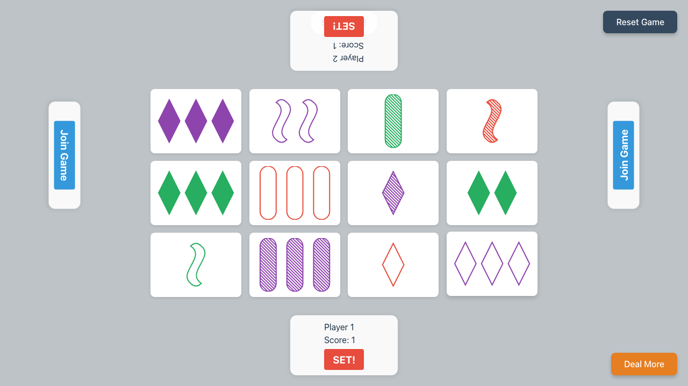

**Verifications**:
- [x] Player 2 found a set: 2-squiggle-green-open, 2-pill-purple-striped, 2-diamond-red-solid
- [x] Cards were removed/replaced

---

### 7. Turn 3 Complete

**Screenshot**: `006-turn-3-complete.png`

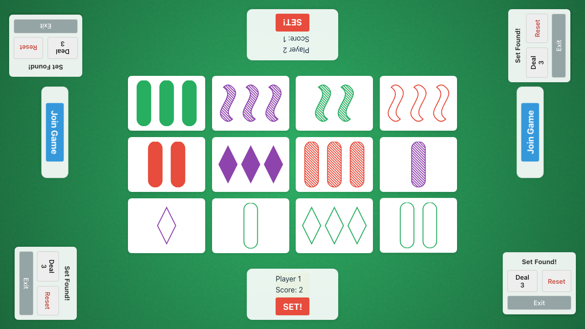

**Verifications**:
- [x] Player 1 found a set: 1-pill-green-striped, 1-squiggle-red-striped, 1-diamond-purple-striped
- [x] Cards were removed/replaced

---

### 8. Turn 4 Complete

**Screenshot**: `007-turn-4-complete.png`

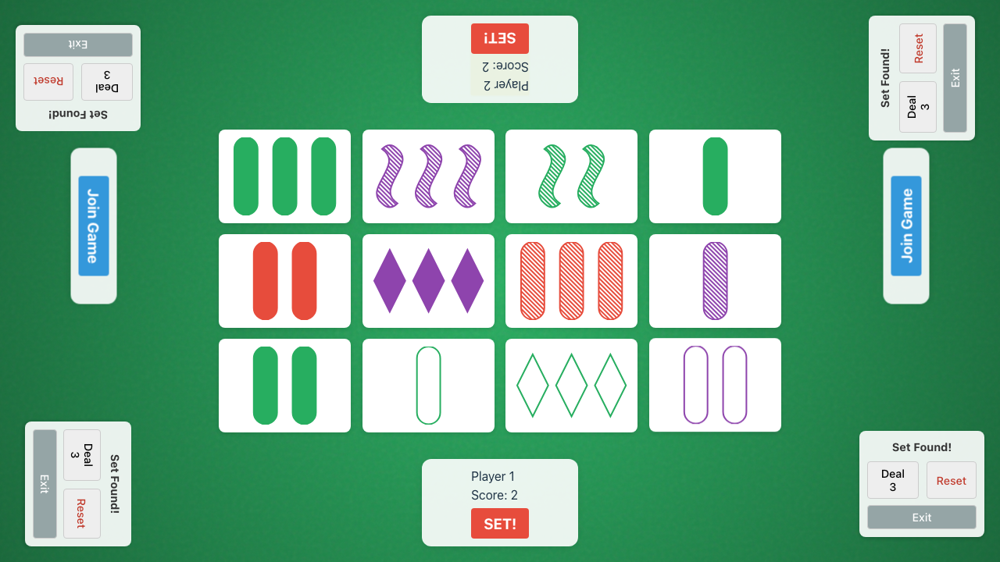

**Verifications**:
- [x] Player 2 found a set: 2-squiggle-purple-open, 1-pill-red-striped, 3-diamond-green-solid
- [x] Cards were removed/replaced

---

### 9. Turn 5 Complete

**Screenshot**: `008-turn-5-complete.png`

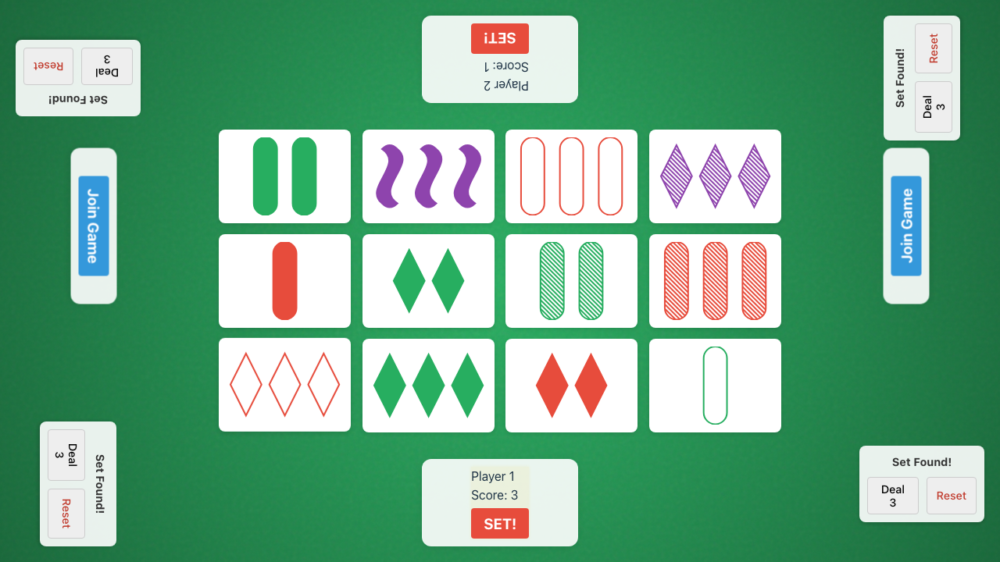

**Verifications**:
- [x] Player 1 found a set: 1-pill-red-open, 1-diamond-purple-open, 1-squiggle-green-open
- [x] Cards were removed/replaced

---

### 10. Turn 6 Dealt More

**Screenshot**: `009-turn-6-dealt-more.png`

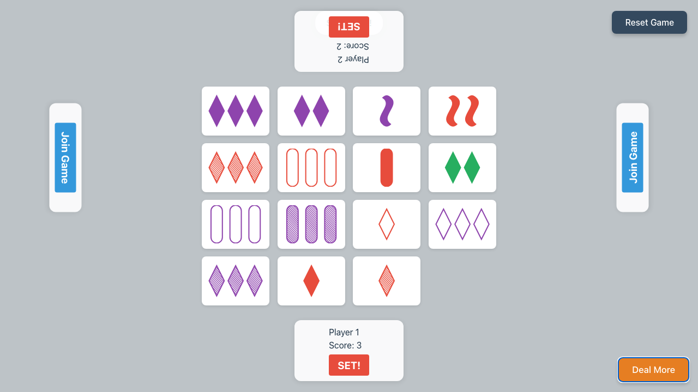

**Verifications**:
- [x] Board size increased

---

### 11. Turn 7 Complete

**Screenshot**: `010-turn-7-complete.png`

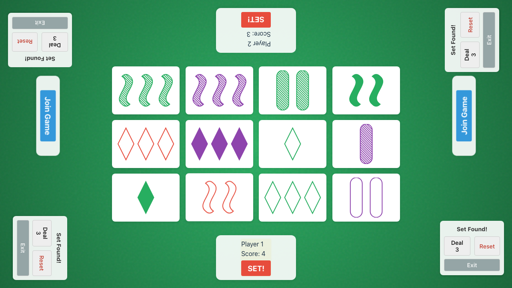

**Verifications**:
- [x] Player 1 found a set: 3-diamond-purple-solid, 2-diamond-green-solid, 1-diamond-red-solid
- [x] Cards were removed/replaced

---

### 12. Turn 8 Complete

**Screenshot**: `011-turn-8-complete.png`

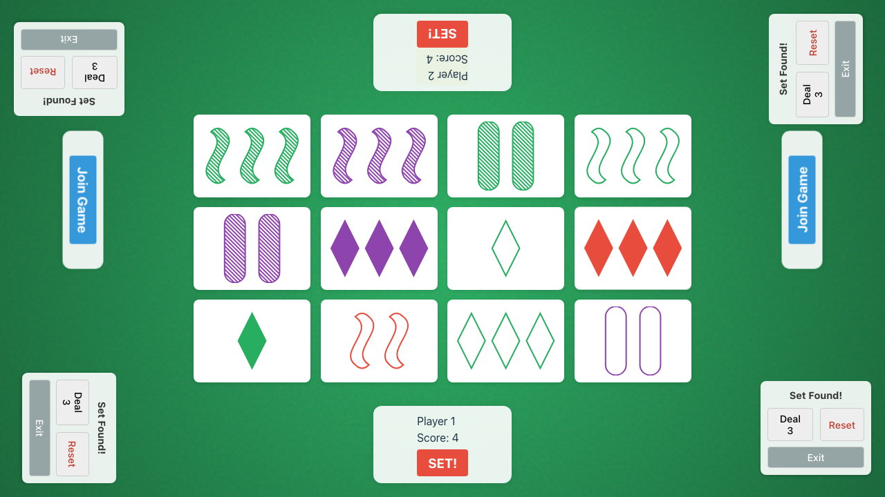

**Verifications**:
- [x] Player 2 found a set: 2-squiggle-red-solid, 3-pill-red-open, 1-diamond-red-striped
- [x] Cards were removed/replaced

---

### 13. Turn 9 Complete

**Screenshot**: `012-turn-9-complete.png`

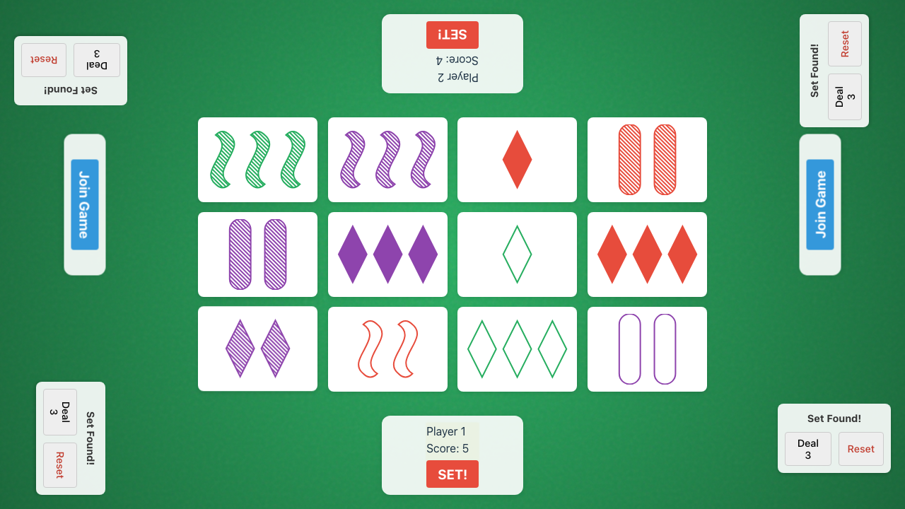

**Verifications**:
- [x] Player 1 found a set: 3-squiggle-purple-open, 3-pill-purple-open, 3-diamond-purple-open
- [x] Cards were removed/replaced

---

### 14. Turn 10 Complete

**Screenshot**: `013-turn-10-complete.png`

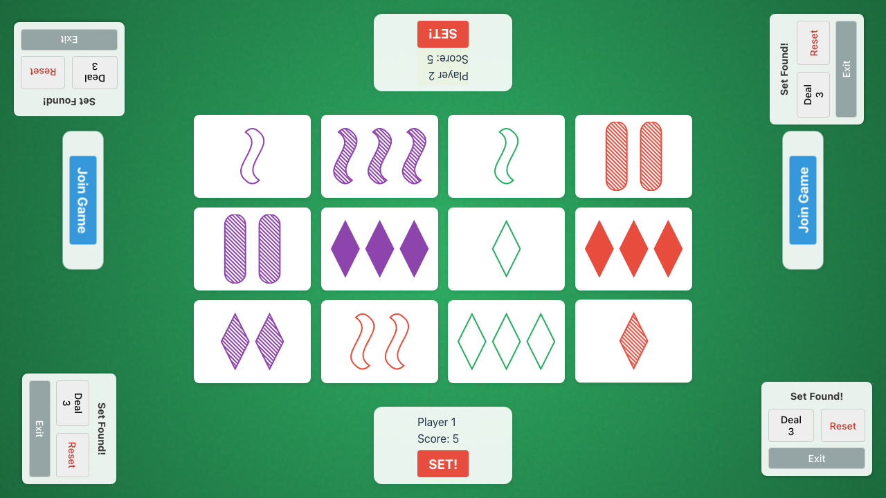

**Verifications**:
- [x] Player 2 found a set: 3-squiggle-red-open, 1-pill-red-solid, 2-diamond-red-striped
- [x] Cards were removed/replaced

---

### 15. Turn 11 Complete

**Screenshot**: `014-turn-11-complete.png`

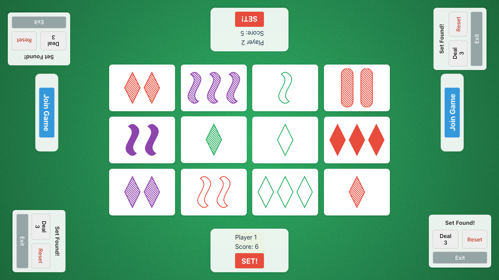

**Verifications**:
- [x] Player 1 found a set: 2-diamond-purple-solid, 2-pill-red-solid, 2-squiggle-green-solid
- [x] Cards were removed/replaced

---

### 16. Turn 12 Complete

**Screenshot**: `015-turn-12-complete.png`

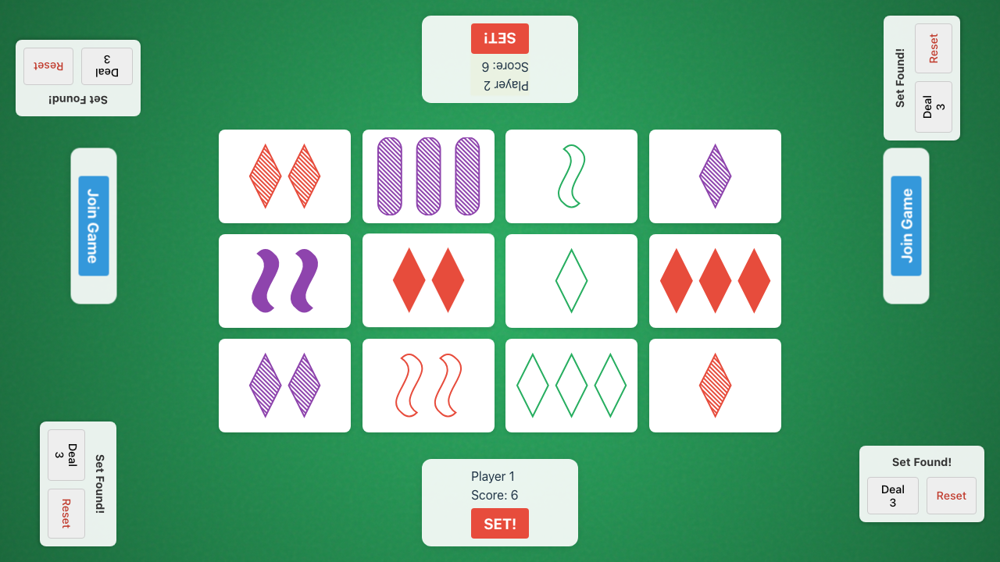

**Verifications**:
- [x] Player 2 found a set: 3-diamond-green-open, 3-diamond-red-solid, 3-diamond-purple-striped
- [x] Cards were removed/replaced

---

### 17. Turn 13 Complete

**Screenshot**: `016-turn-13-complete.png`

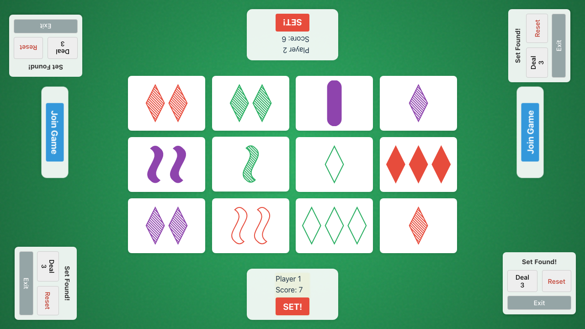

**Verifications**:
- [x] Player 1 found a set: 1-squiggle-purple-solid, 2-diamond-red-open, 3-pill-green-striped
- [x] Cards were removed/replaced

---

### 18. Turn 14 Complete

**Screenshot**: `017-turn-14-complete.png`

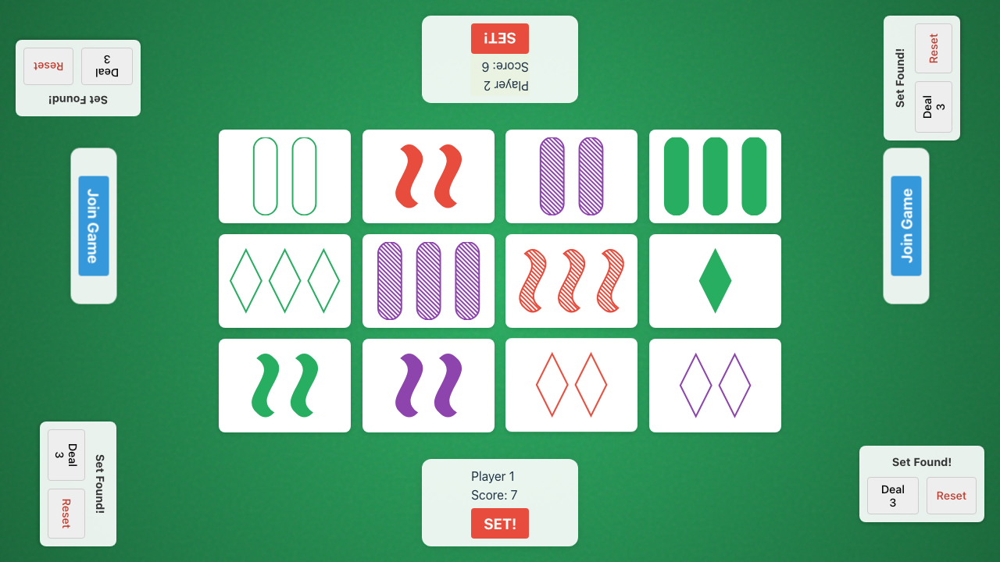

**Verifications**:
- [x] Player 2 found a set: 2-diamond-purple-open, 1-diamond-green-solid, 3-diamond-red-striped
- [x] Cards were removed/replaced

---

### 19. Turn 15 Dealt More

**Screenshot**: `018-turn-15-dealt-more.png`

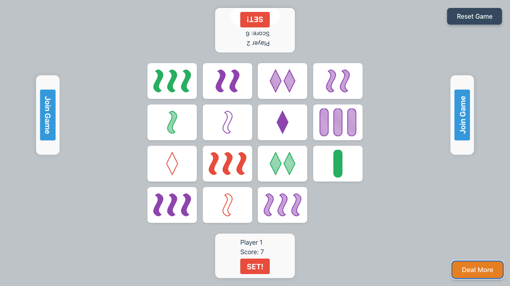

**Verifications**:
- [x] Board size increased

---

### 20. Turn 16 Complete

**Screenshot**: `019-turn-16-complete.png`

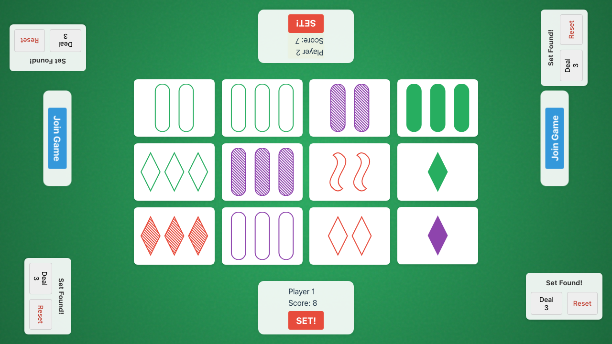

**Verifications**:
- [x] Player 2 found a set: 3-squiggle-green-solid, 2-squiggle-purple-striped, 1-squiggle-red-open
- [x] Cards were removed/replaced

---

### 21. Turn 17 Complete

**Screenshot**: `020-turn-17-complete.png`

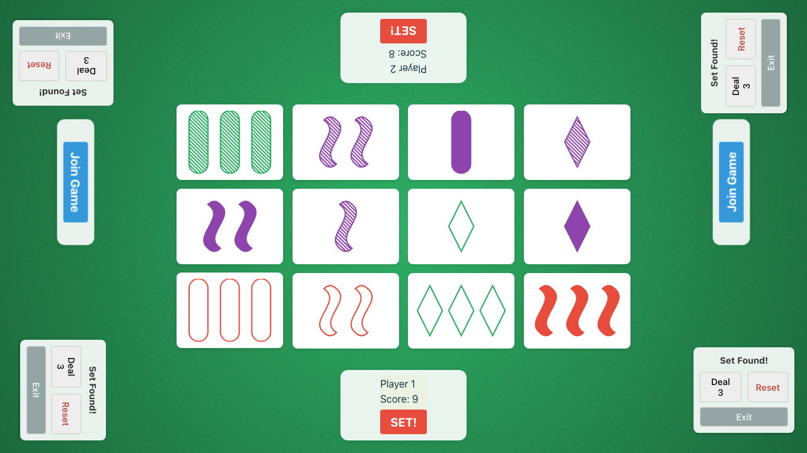

**Verifications**:
- [x] Player 1 found a set: 2-squiggle-purple-solid, 1-squiggle-purple-open, 3-squiggle-purple-striped
- [x] Cards were removed/replaced

---

### 22. Turn 18 Complete

**Screenshot**: `021-turn-18-complete.png`

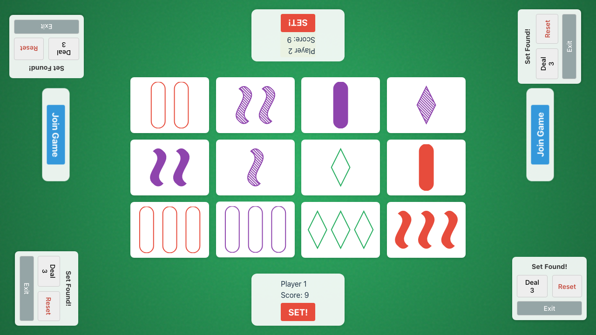

**Verifications**:
- [x] Player 2 found a set: 3-pill-green-solid, 1-squiggle-green-striped, 2-diamond-green-open
- [x] Cards were removed/replaced

---

### 23. Turn 19 Dealt More

**Screenshot**: `022-turn-19-dealt-more.png`

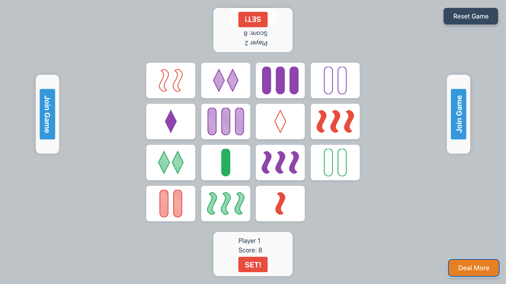

**Verifications**:
- [x] Board size increased

---

### 24. Turn 20 Complete

**Screenshot**: `023-turn-20-complete.png`

**Verifications**:
- [x] Player 2 found a set: 1-diamond-purple-solid, 1-pill-green-solid, 1-squiggle-red-solid
- [x] Cards were removed/replaced

---

### 25. Turn 21 Complete

**Screenshot**: `024-turn-21-complete.png`

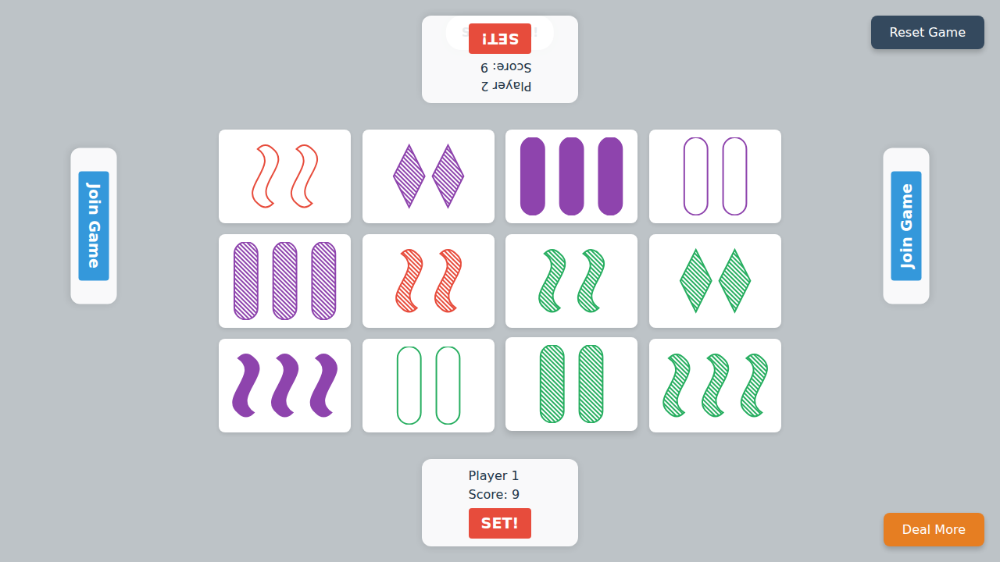

**Verifications**:
- [x] Player 1 found a set: 1-diamond-red-open, 3-squiggle-red-solid, 2-pill-red-striped
- [x] Cards were removed/replaced

---

### 26. Turn 22 Complete

**Screenshot**: `025-turn-22-complete.png`

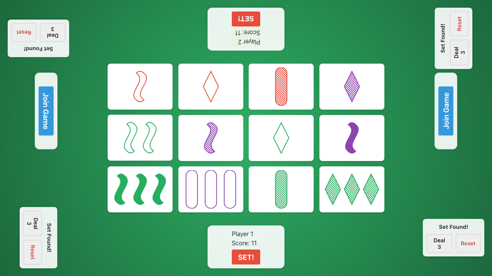

**Verifications**:
- [x] Player 2 found a set: 2-diamond-purple-striped, 2-squiggle-red-striped, 2-pill-green-striped
- [x] Cards were removed/replaced

---

### 27. Turn 23 Complete

**Screenshot**: `026-turn-23-complete.png`

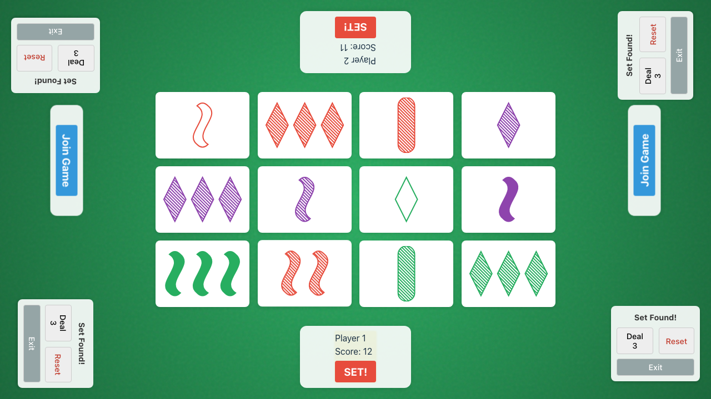

**Verifications**:
- [x] Player 1 found a set: 1-squiggle-purple-striped, 3-pill-red-striped, 2-diamond-green-striped
- [x] Cards were removed/replaced

---

### 28. Turn 24 Complete

**Screenshot**: `027-turn-24-complete.png`

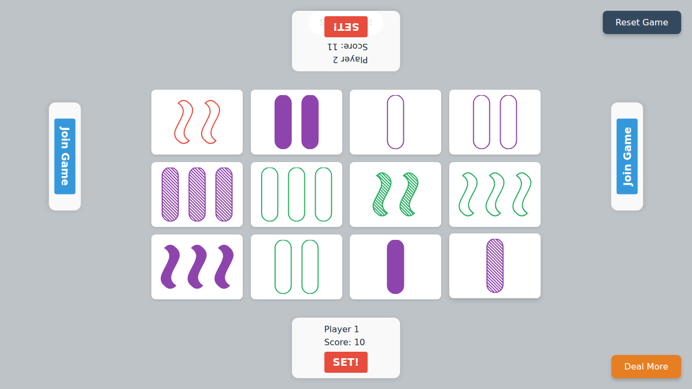

**Verifications**:
- [x] Player 2 found a set: 3-pill-purple-solid, 3-diamond-red-open, 3-squiggle-green-striped
- [x] Cards were removed/replaced

---

### 29. Turn 25 Complete

**Screenshot**: `028-turn-25-complete.png`

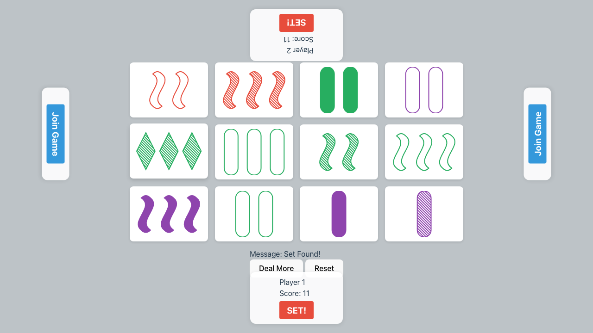

**Verifications**:
- [x] Player 1 found a set: 2-pill-purple-solid, 1-pill-purple-open, 3-pill-purple-striped
- [x] Cards were removed/replaced

---

### 30. Turn 26 Complete

**Screenshot**: `029-turn-26-complete.png`

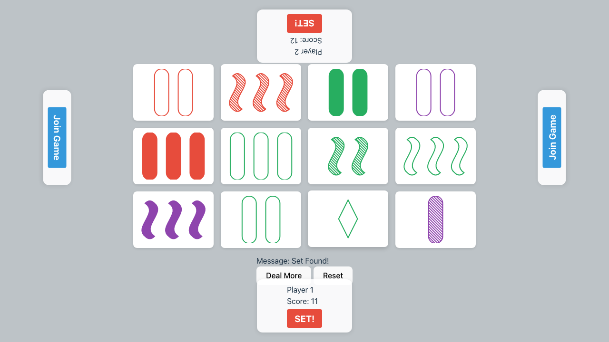

**Verifications**:
- [x] Player 2 found a set: 2-squiggle-red-open, 3-diamond-green-striped, 1-pill-purple-solid
- [x] Cards were removed/replaced

---

### 31. Turn 27 Complete

**Screenshot**: `030-turn-27-complete.png`

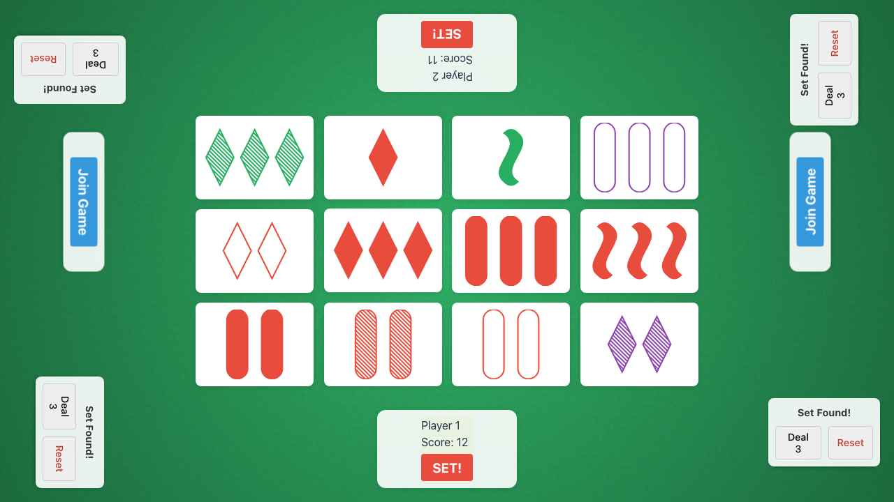

**Verifications**:
- [x] Player 1 found a set: 2-pill-red-open, 2-pill-purple-open, 2-pill-green-open
- [x] Cards were removed/replaced

---

### 32. Turn 28 Complete

**Screenshot**: `031-turn-28-complete.png`

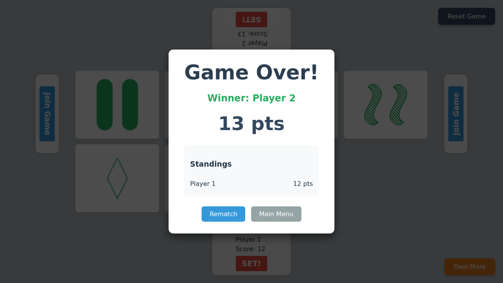

**Verifications**:
- [x] Player 2 found a set: 3-squiggle-red-striped, 3-squiggle-green-open, 3-squiggle-purple-solid
- [x] Cards were removed/replaced

---

### 33. Game Over

**Screenshot**: `032-game-over.png`

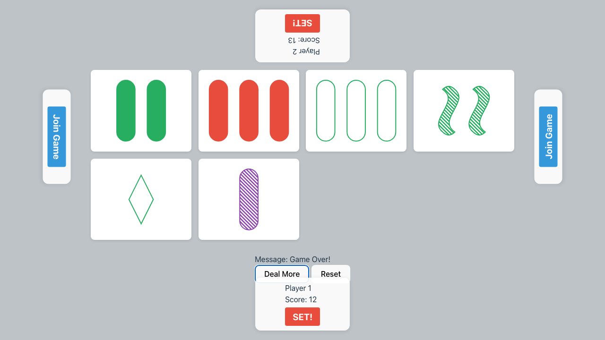

**Verifications**:
- [x] Final Scores: P1=12, P2=13

---

